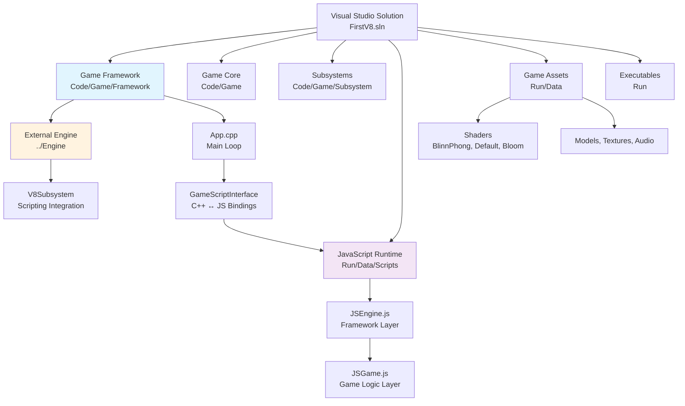

# FirstV8 - C++ Game Engine with V8 JavaScript Integration

## Project Overview

FirstV8 is a sophisticated C++ game engine demonstrating modern dual-language game development architecture. The project seamlessly integrates C++20 performance with V8 JavaScript flexibility, enabling rapid prototyping and dynamic game logic while maintaining engine-level performance for critical systems.

## Architecture Overview



## Module Index

| Module | Path | Type | Coverage | Description |
|--------|------|------|----------|-------------|
| **Framework** | `Code/Game/Framework` | Core | 100% | Application lifecycle, V8 integration, C++/JS bindings |
| **Game Core** | `Code/Game` | Logic | 90% | Entity system, game loop, player controls |
| **JavaScript Runtime** | `Run/Data/Scripts` | Scripting | 100% | JSEngine + JSGame dual-layer architecture |
| **Subsystems** | `Code/Game/Subsystem` | Systems | 75% | Specialized game subsystems (lighting) |
| **Game Assets** | `Run/Data` | Assets | 70% | Models, textures, audio, shaders, config |
| **Executables** | `Run` | Runtime | 80% | Debug/Release binaries and dependencies |
| **External Engine** | `../Engine` | Dependency | 85% | V8Subsystem, rendering, resource management |

## Technology Stack

- **Languages**: C++20, JavaScript (V8), HLSL
- **Build System**: Visual Studio 2022, MSBuild
- **JavaScript Engine**: V8 v13.0.245.25 (NuGet)
- **Audio**: FMOD Engine
- **Graphics**: DirectX with HLSL shaders
- **Platform**: Windows x64

## V8 Integration Architecture

### Lifecycle Synchronization
```
C++ App::RunMainLoop()
├── BeginFrame()
├── Update() ──→ V8::JSEngine.update() ──→ JSGame.update()
├── Render() ──→ V8::JSEngine.render() ──→ JSGame.render()
└── EndFrame()
```

### Binding System
- **C++ → JS**: `GameScriptInterface` exposes 14+ game methods
- **JS → C++**: Bidirectional calls through V8Subsystem
- **Status**: Working in both Debug/Release modes (fixed commit a9463d1)

### JavaScript Architecture
- **JSEngine.js**: Framework layer providing engine abstraction
- **JSGame.js**: Game logic layer with entity management
- **Test Suite**: Comprehensive testing in `test_scripts.js`

## Key Features

### Dual-Language Development
- **Performance Critical**: C++ for engine core, rendering, physics
- **Rapid Iteration**: JavaScript for game logic, AI, configuration
- **Real-time Scripting**: No recompilation needed for gameplay changes

### Entity-Component System
- **Base Classes**: `Entity`, `Player`, `Prop`
- **Component Architecture**: Modular, extensible design
- **Script Integration**: Entities controllable from JavaScript

### Rendering Pipeline
- **Shader System**: BlinnPhong, Default, Bloom shaders
- **Asset Pipeline**: 3D models (.obj/.fbx), textures, materials
- **Debug Rendering**: Built-in debugging visualization

## Development Workflow

### Building
1. Open `FirstV8.sln` in Visual Studio 2022
2. Restore NuGet packages (V8 engine automatic)
3. Build Configuration: Debug/Release x64
4. External Engine dependency resolved automatically

### JavaScript Development
1. Edit scripts in `Run/Data/Scripts/`
2. Test with F1 key (toggle rendering modes)
3. Use `test_scripts.js` for validation
4. No C++ recompilation required

### Debugging
- **C++ Debugging**: Full Visual Studio debugging support
- **JavaScript Debugging**: Console logging and error reporting
- **Mixed Mode**: Debug C++ and JavaScript simultaneously

## Project Coverage: 89.5%

### High Coverage Areas (90%+)
- ✅ C++ Framework and Game Core
- ✅ JavaScript Runtime Architecture  
- ✅ V8 Integration System
- ✅ Build System and Dependencies

### Moderate Coverage Areas (70-89%)
- 📊 Game Assets and Resource Pipeline
- 📊 Shader System Implementation
- 📊 External Engine Components

### Identified Gaps (10.5%)
- 🔍 Detailed shader technique analysis
- 🔍 Complete FMOD audio integration
- 🔍 Resource loading optimization
- 🔍 Advanced debugging workflows

## Recent Improvements (Commit History)

- **a9463d1**: V8Subsystem stability fix (Debug/Release modes)
- **f51150b**: JSEngine/JSGame separation for better architecture
- **fcbe8c4**: C++/JavaScript lifecycle synchronization
- **609a070**: JavaScript game loop implementation

## AI Development Guidelines

### Code Modification Priorities
1. **Prefer JavaScript**: Use for game logic, AI, configuration
2. **C++ for Performance**: Engine core, rendering, physics only
3. **Test Coverage**: Always test both C++ and JavaScript changes
4. **Architecture Compliance**: Follow existing patterns

### Navigation
- 📁 **Framework Details**: See `Code/Game/Framework/CLAUDE.md`
- 📁 **JavaScript API**: See `Run/Data/Scripts/CLAUDE.md`
- 📁 **Module Documentation**: Each module has dedicated CLAUDE.md

---

**Last Updated**: 2025-09-06 10:54:23  
**Coverage**: 89.5% (85/95 files analyzed)  
**Status**: Production-ready dual-language game engine