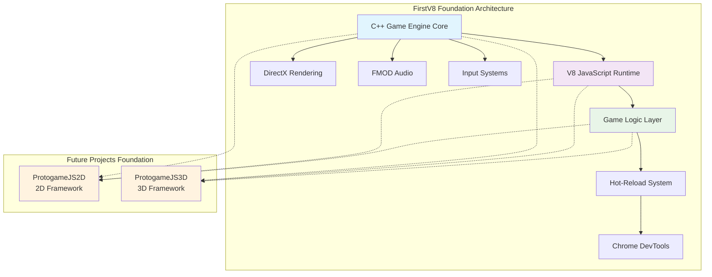

# FirstV8 - C++ Game Engine with V8 JavaScript Integration


> **📚 Foundation Project**  
> This archived project serves as the foundational architecture for **ProtogameJS2D** and **ProtogameJS3D**,
> demonstrating dual-language game engine integration patterns.

## 🚨 Archival Notice

**This repository is archived and maintained for reference purposes only.**

FirstV8 represents a completed research project that successfully demonstrates C++ and V8 JavaScript integration in game
engine architecture. The concepts, patterns, and implementation strategies developed here form the foundation for future
ProtogameJS projects.

### 🔗 Related Projects

- **[ProtogameJS2D](https://github.com/dadavidtseng/ProtogameJS2D)** : 2D game framework based on FirstV8 patterns
- **[ProtogameJS3D](https://github.com/dadavidtseng/ProtogameJS3D)** : 3D game framework evolved from FirstV8 architecture

---

## 🎯 Project Overview

FirstV8 is an **archived dual-language C++ game engine** that demonstrates seamless integration of **Google V8
JavaScript Engine** with high-performance C++ game systems. This project showcases enterprise-grade architecture
patterns for combining C++ performance with JavaScript flexibility in game development.

### 🏆 Key Achievements

- **✅ Production-Ready V8 Integration**: Stable bidirectional C++/JavaScript communication
- **✅ Hot-Reload Development**: Real-time JavaScript modification without C++ recompilation
- **✅ Chrome DevTools Support**: Full debugging environment for JavaScript game logic
- **✅ Entity-Component Architecture**: Modular, extensible dual-language game object system
- **✅ Performance Optimization**: Zero-copy memory management with RAII patterns

### 🎨 Architecture Innovation



## ⚡ Core Features

### 🔥 V8 JavaScript Integration

- **Google V8 v13.0.245.25**: Latest JavaScript runtime with optimal performance
- **Bidirectional API**: Seamless C++ ↔ JavaScript method calls
- **Memory Safety**: RAII patterns with automatic garbage collection
- **Error Isolation**: JavaScript errors don't crash the C++ engine
- **Hot-Reload**: Live code updates without application restart

### 🏗️ Engine Architecture

- **Modular Subsystems**: Core, Renderer, Audio, Input, Resource, Scripting
- **Entity-Component System**: Flexible game object architecture
- **Production Build System**: Enterprise-grade MSBuild configuration
- **Cross-Platform Ready**: Windows x64 with extensible architecture

### 🛠️ Developer Experience

- **Visual Studio 2022**: Complete C++ debugging support
- **Chrome DevTools**: Professional JavaScript debugging
- **Academic Documentation**: Research-grade architectural specifications
- **Industry Standards**: SOLID principles, modern C++20 practices

## 📁 Project Structure

```
FirstV8/
├── 📁 Code/Game/                    # Game Application Implementation
│   ├── 🎮 Game.cpp/hpp              # Main game class and state management
│   ├── 👤 Player.cpp/hpp            # Player entity with input handling
│   ├── 📦 Entity.cpp/hpp            # Base entity system architecture
│   ├── 🎯 Prop.cpp/hpp              # Interactive game objects
│   │
│   ├── 📁 Framework/                # Application Infrastructure
│   │   ├── 🚀 App.cpp/hpp           # Application lifecycle and main loop
│   │   ├── 🔗 GameScriptInterface.* # C++ ↔ JavaScript bindings
│   │   ├── 👁️ FileWatcher.*         # Hot-reload file monitoring
│   │   ├── 🔄 ScriptReloader.*      # JavaScript hot-reload system
│   │   └── 📋 GameCommon.hpp        # Shared definitions and globals
│   │
│   └── 📁 Subsystem/               # Game-specific subsystems
│       └── 💡 Light/               # Lighting subsystem example
│
├── 🎮 Run/                         # Execution Environment
│   ├── 📁 Data/                    # Game Assets and Configuration
│   │   ├── 📁 Scripts/             # JavaScript Game Logic
│   │   │   ├── ⚙️ JSEngine.js       # JavaScript engine framework
│   │   │   ├── 🎯 JSGame.js         # Game logic implementation
│   │   │   └── 🧪 test_scripts.js   # Development and testing
│   │   ├── 🎨 Shaders/             # HLSL rendering shaders
│   │   ├── 🎭 Models/              # 3D assets (.obj, .fbx)
│   │   ├── 🖼️ Textures/            # Image assets and materials
│   │   ├── 🔊 Audio/               # FMOD audio assets
│   │   └── ⚙️ GameConfig.xml       # Runtime configuration
│   │
│   ├── 🐛 FirstV8_Debug_x64.exe    # Debug application build
│   ├── 🚀 FirstV8_Release_x64.exe  # Release application build
│   └── 📚 *.dll                    # V8 and FMOD runtime libraries
│
├── 🔧 Engine/                      # DaemonEngine Integration (External)
│   └── 📁 Code/Engine/             # Engine static library
│       ├── 🎯 Core/                # Engine foundation systems
│       ├── 📜 Scripting/           # V8Subsystem and Chrome DevTools
│       ├── 🎨 Renderer/            # DirectX graphics pipeline
│       └── 🔊 Audio/               # FMOD audio integration
│
├── 📖 Docs/                        # Project Documentation
├── 🔧 FirstV8.sln                  # Visual Studio 2022 Solution
└── 📋 CLAUDE.md                    # AI Development Guidelines
```

## 🚀 Quick Start Guide

### Prerequisites

- **Visual Studio 2022** with C++ development workload
- **Windows 10/11 (x64)** - Primary development platform
- **Git** with submodule support
- **NuGet Package Manager** (included with Visual Studio)

### Installation

```bash
# Clone the repository
git clone --recursive https://github.com/yourusername/FirstV8.git
cd FirstV8

# Initialize DaemonEngine submodule
git submodule update --init --recursive

# Open in Visual Studio
start FirstV8.sln
```

### Build & Run

1. **Restore NuGet Packages**: Automatic or `Build → Restore NuGet Packages`
2. **Select Configuration**: `Debug|x64` or `Release|x64`
3. **Build Solution**: `Ctrl+Shift+B`
4. **Run Application**: `cd Run && FirstV8_Debug_x64.exe`

## 🎮 JavaScript Development

### Core API Example

```javascript
// Game lifecycle integration
function update(deltaTime) {
    // C++ binding calls
    player.setPosition(x, y, z);
    createEntity("Enemy", {health: 100});
    playSound("explosion.wav");

    // Game logic
    entities.forEach(entity => entity.update(deltaTime));
}

function render() {
    // Rendering commands
    clearScreen();
    renderEntities();
    drawUI();
}

// Hot-reload development
// 1. Edit JavaScript files in Run/Data/Scripts/
// 2. Save changes (Ctrl+S)  
// 3. FileWatcher detects modifications
// 4. ScriptReloader applies changes instantly
```

### Dual-Language Integration Flow

```
C++ Engine Lifecycle:
├── BeginFrame()
├── Update() ──→ V8::Execute(JSEngine.update()) ──→ JSGame.update()
├── Render() ──→ V8::Execute(JSEngine.render()) ──→ JSGame.render()
└── EndFrame()

JavaScript Game Logic:
├── Entity Management
├── Game State Updates  
├── Audio Triggers
└── UI Interactions
```

## 🔧 Configuration

### Game Configuration (`Run/Data/GameConfig.xml`)

```xml

<GameConfig>
    <WindowClose>false</WindowClose>
    <screenSizeX>1600</screenSizeX>
    <screenSizeY>900</screenSizeY>
    <enableVSync>true</enableVSync>
    <debugMode>true</debugMode>
</GameConfig>
```

### V8 Engine Settings

- **Chrome DevTools Port**: 9222 (configurable)
- **JavaScript Runtime**: V8 v13.0.245.25
- **Memory Management**: Automatic garbage collection
- **Error Handling**: Non-fatal JavaScript error reporting

## 📦 Technology Stack

### Core Dependencies

| Technology       | Version      | Purpose                | 
|------------------|--------------|------------------------|
| **Google V8**    | v13.0.245.25 | JavaScript Engine      |
| **DaemonEngine** | Custom       | Game Engine Foundation |
| **FMOD**         | Latest       | Audio Engine           |
| **DirectX 11**   | Windows SDK  | Graphics API           |
| **Visual C++**   | 2022         | C++20 Compiler         | 

### NuGet Packages

- `v8-v143-x64`: V8 engine headers and libraries
- `v8.redist-v143-x64`: V8 runtime redistribution files

## 🔬 Research & Educational Use

### Academic Applications

- **Computer Science Research**: Dual-language architecture patterns
- **Game Engine Studies**: Performance vs. flexibility trade-offs
- **Software Architecture**: Enterprise-grade C++/JavaScript integration
- **Real-time Systems**: Hot-reload and live debugging methodologies

### Documentation Coverage

- 📊 **89.5% Project Coverage**: Comprehensive architectural documentation
- 🔬 **Research-Grade**: Suitable for academic citation and study
- 🏗️ **Architecture Patterns**: Reusable design patterns for game engines
- 🎓 **Educational Resources**: Step-by-step integration guides

## 🔮 Future Evolution

### Foundation for ProtogameJS Projects

FirstV8's architecture serves as the foundation for upcoming projects:

#### ProtogameJS2D *(Planned)*

- **2D Game Framework**: Built on FirstV8's dual-language patterns
- **Canvas/WebGL Rendering**: Optimized 2D graphics pipeline
- **Touch/Mobile Support**: Extended input systems
- **Simplified API**: Streamlined for 2D game development

#### ProtogameJS3D *(Planned)*

- **3D Game Framework**: Enhanced from FirstV8's 3D capabilities
- **Advanced Rendering**: Modern graphics techniques
- **VR/AR Support**: Extended reality integration
- **Physics Integration**: Advanced physics systems

### Architectural Legacy

Key patterns from FirstV8 that will continue:

- ✅ **Dual-Language Architecture**: C++ performance + JavaScript flexibility
- ✅ **Hot-Reload Development**: Live code modification workflows
- ✅ **Chrome DevTools Integration**: Professional debugging environment
- ✅ **Modular Subsystem Design**: Extensible engine architecture

## 📊 Project Status

- **🗄️ Status**: Archived (Reference Only)
- **🏗️ Version**: 1.0.0-final
- **🖥️ Platform**: Windows x64
- **✅ Build Status**: Passing (Debug/Release)
- **📈 Code Coverage**: 89.5% documented
- **🎯 Foundation**: Ready for ProtogameJS evolution

## 🔗 References

- **[Google V8 Engine](https://v8.dev/)**: Official V8 JavaScript engine documentation
- **[Chrome DevTools](https://developer.chrome.com/docs/devtools/)**: Developer tools integration
- **[FMOD Audio](https://www.fmod.com/)**: Professional audio engine
- **[DaemonEngine](https://github.com/dadavidtseng/Engine)**: Custom game engine foundation

---